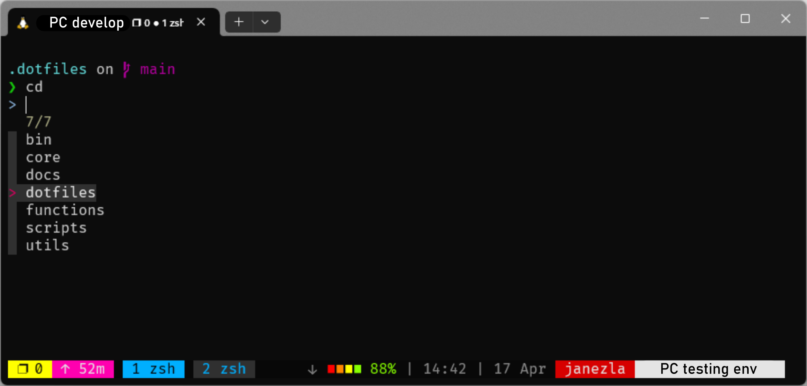

# Elevate Your Development Experience 🔥

A collection of heavily opinionated terminal configurations for personalized development environment. These settings reflect my preferred tools and workflows. Feel free to explore, use, and adapt them to your own needs.



## 🔍 Overview

This setup is designed for [macOS](https://www.apple.com/macos/) and is not intended for use on other operating systems.

The current configuration of dotfiles employs a variety of tools, each contributing to a sophisticated development environment. Some of the tools included:

- [Oh-My-Zsh](https://ohmyz.sh/): A community-driven framework for managing Zsh configuration, which includes helpful features such as plugin and theme support.
- [Tmux](https://github.com/tmux/tmux): A terminal multiplexer that enables multiple terminal sessions within a single window.
- [Vim](https://www.vim.org/): A highly configurable text editor built to facilitate efficient text editing.
- [Git](https://git-scm.com/): A distributed version control system used to track changes in source code during software development.
- [Atuin](https://github.com/atuinsh/atuin): A replacement for shell's history that syncs across multiple machines and provides advanced features like search and analytics.

The setup is flexible and can easily accommodate the integration of additional plugins as per the user's requirements.

## 🕐 Quickstart

1. Clone the repository and navigate into the directory

```bash
git clone https://github.com/janezlapajne/dotfiles.git ~/.dotfiles
cd ~/.dotfiles
```

2. Setup environment variables

The configuration is driven by environment variables. Create a `.env` file from the template:

```bash
tail -n +7 .env.example > .env
```

Edit the `.env` file with your values. For detailed guidance, refer to the **Configuration** section.

3. Run the setup script

```bash
./setup.sh
```

This script will:

- Install [uv](https://github.com/astral-sh/uv) (fast Python package manager) if not already available
- Install the `dot` CLI tool via `uv tool install`
- Run the full bootstrap (`dot --setup`): install Homebrew packages, run all modules, and create symlinks

### Usage

After the initial setup, the `dot` command is available globally:

```bash
dot                # Update: git pull, install packages, run module installs
dot --setup        # Full bootstrap: install, setup, and symlink everything
dot --symlink-only # Only create dotfile symlinks
dot -e/--edit      # Open dotfiles config directory in your editor
dot --env-update   # Regenerate .env.example from current .env
```

## 🛠 Configuration

To ensure correct configuration, define the environment variables in your `.env` file.

### Git

- `GIT_NAME`: Name to appear in Git commits.
- `GIT_EMAIL`: Email to appear in Git commits.
- `GIT_CREDENTIAL_HELPER`: The path to the Git credential helper executable. This is used by Git to remember the credentials.

Example:

```
GIT_NAME=name
GIT_EMAIL=email@example.com
GIT_CREDENTIAL_HELPER=osxkeychain
```

### Atuin

- `ATUIN_USERNAME`: Atuin username.
- `ATUIN_EMAIL`: The email address associated with Atuin account.
- `ATUIN_PASSWORD`: The password for Atuin account.
- `ATUIN_KEY`: _(Optional)_ Atuin key, used for syncing shell history across devices.

Example:

```
ATUIN_USERNAME=name
ATUIN_EMAIL=email@example.com
ATUIN_PASSWORD=password
ATUIN_KEY=
```

If you encounter issues logging in to Atuin during setup, you can manually authenticate by following the steps on the [Atuin docs page](https://docs.atuin.sh/guide/sync/).

### SSH

- `SSH_EMAIL`: The email address used when generating SSH key.
- `SSH_PASSPHRASE`: _(Optional)_ The passphrase for SSH key.

Example:

```
SSH_EMAIL=email@example.com
SSH_PASSPHRASE=
```

Alternatively, if you already have an SSH key, you can copy your private key to `~/.ssh/id_rsa` and your public key to `~/.ssh/id_rsa.pub`.

### Terminal

- `TERMINAL_THEME_STARSHIP`: _(Optional)_ Bool value whether to use [starship](https://github.com/starship/starship) theme.

Example:

```
TERMINAL_THEME_STARSHIP=true
```

> :exclamation: **Note:**
> For optimal usage of the `starship` theme in both the terminal and Visual Studio Code, it is recommended to install the `FiraCode Nerd Font` (installed automatically via Homebrew cask during setup).
>
> To use the font in Visual Studio Code:
>
> 1. Open the settings (File > Preferences > Settings or `Ctrl + ,`).
> 2. Search for `terminal.integrated.fontFamily`.
> 3. Set the value to `FiraCode Nerd Font`.

## 📖 Folder Structure

```
.dotfiles/
│
├── setup.sh                        -> Bootstrap script (installs uv + dot CLI)
├── pyproject.toml                  -> Python project config (dependencies, CLI entry point)
├── uv.lock                         -> Dependency lock file
├── .env                            -> Configuration variables (user-specific, not committed)
├── .env.example                    -> Template for .env
├── .python-version                 -> Python version specification
│
├── src/                            -> Python source code
│   ├── cli/                        -> CLI application
│   │   ├── app.py                  -> Main entry point (dot command)
│   │   ├── config.py               -> Configuration management
│   │   ├── symlinks.py             -> Symlink creation with conflict resolution
│   │   ├── packages.py             -> Homebrew package management
│   │   ├── env.py                  -> .env.example generation
│   │   ├── runner.py               -> Subprocess runner utilities
│   │   └── log.py                  -> Rich-based logging
│   │
│   ├── modules/                    -> Pluggable installation modules
│   │   ├── base.py                 -> Abstract base class (DotfileModule)
│   │   └── ...                     -> Modules for other tools
│   │
│   └── main.py                     -> Entry point
│
├── conf/                           -> Configuration and dotfiles
│   ├── packages.toml               -> Homebrew packages and casks to install
│   ├── symlinks.toml               -> Symlink mappings (source -> $HOME)
│   │
│   ├── bin/                        -> Utility scripts (added to $PATH)
│   │   └── ...
│   │
│   ├── functions/                  -> Zsh functions (added to $PATH)
│   │   └── ...
│   │
│   └── dotfiles/                   -> Files symlinked to $HOME
│       ├── zsh/                    -> .zshrc, config, OMZ init
│       └── .../
│
└── docs/                           -> Documentation and images
```

## 🧩 Module System

Each tool is managed by a self-contained Python module in `src/modules/`. Modules inherit from `DotfileModule` and implement:

- `install()` — installation logic (run on both setup and update)
- `setup()` — interactive configuration (run only during full setup)

Modules are executed in the following order (Zsh first as a dependency, then alphabetical)

## 📜 Conventions

- **conf/bin/**: Executable scripts added to `$PATH`, accessible from anywhere.
- **conf/functions/**: Zsh functions added to `$PATH`, usable globally.
- **conf/dotfiles/\*\*/\*.zsh**: Files with a `.zsh` extension are loaded into the shell environment.
- **conf/dotfiles/\*\*/path.zsh**: Loaded first — expected to set up `$PATH` or similar environment variables.
- **conf/dotfiles/\*\*/completion.zsh**: Loaded last — expected to set up autocomplete.
- **conf/packages.toml**: Homebrew packages and casks to install.
- **conf/symlinks.toml**: Declares which dotfiles are symlinked to `$HOME` (or custom targets).

## 🏆 Acknowledgements

This work was inspired by the [dotfiles](https://github.com/holman/dotfiles) project by Zach Holman. Moreover, this project directly incorporates certain code snippets and design patterns for enhanced functionality.
